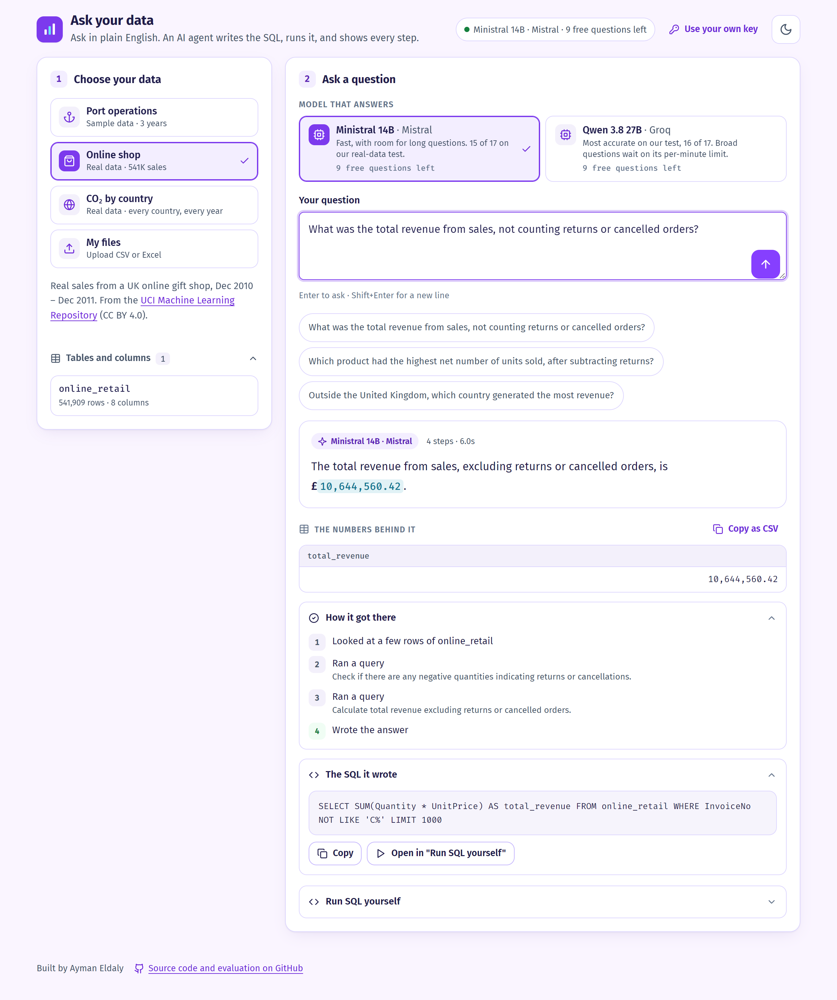

# Ask your data

Ask questions about a spreadsheet or database in plain English — *"Which
customer spent the most?"*, *"How did sales change month by month?"* — and get
the answer, the table of numbers behind it, and every step taken to find it,
including the SQL it wrote. It can only ever **read** your data: nothing you
ask can change or delete it.

Try it on the built-in sample (three years of a container port's operations),
on two real public datasets (a UK online shop's 541,909 sales, and CO₂
emissions by country), or drop in your own CSV and Excel files.

**Try it live: [ask-your-data-i67m.onrender.com](https://ask-your-data-i67m.onrender.com)**,
with nothing to install and no key needed. The first visit after a quiet spell can take
about a minute while the free server wakes up.



---

## Get started

You need **Python 3.11 or newer** — install it from
[python.org/downloads](https://www.python.org/downloads/), and on Windows tick
**"Add python.exe to PATH"** during setup.

**1. Download this project.** Click the green **Code** button at the top of
this page, then **Download ZIP**, and unzip it anywhere.

**2. Start it.**

- **Windows:** double-click **`start-windows.bat`**.
- **Mac / Linux:** open a terminal in the folder and run `./start-mac-linux.sh`.

The first start installs what it needs and builds the sample data — about two
minutes, with an internet connection. After that it starts in seconds, and your
browser opens at **http://localhost:8000**.

**3. Connect a free AI model.** The page shows you how: get a free Google
Gemini key at [aistudio.google.com/apikey](https://aistudio.google.com/apikey)
(no credit card), paste it in, and click **Save key**. It is checked with
Google and stored in a `.env` file on your computer.

Keys for other free models go in `.env` too, and each one adds a model to the
page's picker: `MISTRAL_API_KEY` for Ministral 14B
([console.mistral.ai](https://console.mistral.ai), free plan) and
`GROQ_API_KEY` for Qwen on Groq ([console.groq.com](https://console.groq.com)).
Why these two is under [Choosing the model](#choosing-the-model).

**4. Ask.** Pick a dataset or **My files**, pick a model if there is more
than one, then ask a question or click one of the suggestions. The page shows
each step as it happens - every query and how many rows it returned, and any
pause for a free tier's rate limit - then the answer, the rows behind it, and
the SQL.

The two real datasets are optional: `python scripts/build_examples.py`
downloads and imports them (about 40 MB, under a minute), and the page offers
them from then on.

To stop, close the black window (or press Ctrl+C in it). Your files are kept.

<details>
<summary>Prefer the command line?</summary>

```bash
pip install -r requirements.txt
python app.py              # opens http://localhost:8000
```

Or with Docker: `docker compose up --build` (set `GOOGLE_API_KEY` in `.env`
first — for safety, the page only accepts a key from the same computer).

</details>

---

## Using your own data

Switch to **My files** and drop in **CSV**, **TSV** or **Excel (.xlsx)**
files. Each file becomes a table named after it (`Sales Q3.xlsx` →
`sales_q3`); for Excel, the first sheet is used. The first row must be the
column headers. Uploading a file with the same name again replaces its table.

Your data stays on your computer. When you ask a question, what goes to Google
is the question, the table and column names, and the rows the agent's queries
return while it works — not your whole file.

Each answer comes with:

- **The numbers behind it** — the result table of the final query, so you can
  check the figures instead of trusting the sentence.
- **How it got there** — each step in plain words, including any query that
  failed and how it recovered.
- **The SQL it wrote** — copy it, or open it in **Run SQL yourself** and
  change it.

**Run SQL yourself** works without a key, so you can look around your data
before connecting a model.

## Troubleshooting

| What you see | What to do |
|---|---|
| *"Python 3.11 or newer is needed"* | Install it from python.org; on Windows tick "Add python.exe to PATH". |
| *"Google rejected that key"* | Copy it again from aistudio.google.com/apikey — the whole key, no spaces. |
| *"Google's free AI model is overloaded"* | It happens on the free tier. Wait a minute and ask again. |
| *"the file could not be read as a table"* | Make sure the first row holds the column names and each row is one record. |
| The answer looks wrong | Open **The numbers behind it** and **The SQL it wrote** — the mistake is usually visible there. Asking more specifically, or naming the column, helps. |
| Setup failed partway | Delete the `.venv` folder and run the start file again. |

---

## Running it as a public demo

The same app runs as a public website with one setting,
`AGENT_PUBLIC_MODE=true`. On your own computer there is one user; on a public
server there are strangers, so four things change:

| | On your computer | Public demo |
|---|---|---|
| Uploaded files | yours, kept | a private workspace per visitor, deleted after an hour idle |
| The AI key | saved to `.env` from the page | the server's key, held as a secret; visitors may add their own for their visit only, never written |
| Questions | unlimited | on the server's key: per visitor per hour, and per model per day - each sized to that model's free tier (live: Ministral 14B 150 a day, two at a time; Qwen 35, one at a time); own-key visitors are not counted |
| Files | 50 MB | 10 MB, 5 tables per visitor; Excel files that unpack to 100x their size are refused |

A visitor's workspace is found by a random token the page sends in a header,
not a cookie, so the demo also works embedded in another site, where browsers
block cookies from the iframe. A page left open past the hour gets a clear
"your workspace was cleared" instead of an answer computed on data it is no
longer showing.

The daily total exists because the free Gemini tier allows a fixed number of
model calls a day, and one question takes 3-6 of them. The per-visitor limit
counts the forwarded client address, which can be forged; the daily total is
the limit that cannot be talked around.

The live demo runs on Render's free tier from [`render.yaml`](render.yaml):
the Dockerfile builds the image, including both real datasets. The model keys
are Render secrets, entered once when the service is created, never in the
repository. Linking the repository in Render's dashboard makes every push to
`main` redeploy it. To run your own copy:

[](https://render.com/deploy?repo=https://github.com/0yman/ask-your-data)

The free instance has 512 MB, so DuckDB is capped at 160 MB per database.
Six visitors running heavy queries at once peaked at 254 MB in total, and a
query that needed more than the cap failed on its own with an error, without
taking the server down. Free instances sleep after 15 minutes idle;
[`keep-awake.yml`](.github/workflows/keep-awake.yml) pings the demo every
ten minutes so a visitor rarely waits for it to wake.

## How it works

```
question ──▶ ┌──────────────────────────────────────────────┐
             │ agent loop (max 16 steps)                    │
             │                                              │
             │   model ──▶ tool call ──▶ guardrails ──▶ DB   │
             │     ▲                          │             │
             │     └──── result or error ─────┘             │
             │          (a failure is a message,            │
             │           not an exception)                  │
             └──────────────────────────────────────────────┘
                              │
                              ▼
            answer + result rows + full trace + SQL
```

A tool-calling agent, no framework: the model sees the question and the
schema, calls tools (`list_tables`, `describe_table`, `sample_rows`,
`run_sql`, `final_answer`), reads what comes back, and stops when it has the
numbers. Every SQL statement is parsed and checked before it reaches the
database, on a connection that is read-only in its own right.

The rest of this README is the engineering write-up: the sample data, the
guardrails, and the evaluation — which, like the sibling project, changed
decisions along the way.


## The sample data

A star schema for a container terminal — two fact tables, five conformed
dimensions, three years of daily activity:

| Table | Grain | Rows |
|---|---|---|
| `fact_vessel_call` | one vessel visit to one berth | 4,821 |
| `fact_container_movement` | one customer/cargo group within a call | 16,923 |
| `dim_date` / `dim_vessel` / `dim_berth` / `dim_customer` / `dim_cargo_type` | — | 1,096 / 60 / 8 / 12 / 7 |

Generated from a fixed seed, so a clean clone reproduces the exact database
the evaluation's gold queries were written against. The data is synthetic but
not random: it carries patterns that are *findable*, which is what makes an
analytical question worth asking.

| Planted pattern | What the data shows |
|---|---|
| Seasonal throughput | August peak 204,832 TEU vs January trough 115,138 |
| Customs holds delay release | 10.27 days average dwell vs 5.06 without |
| Hazardous cargo is slowest | 9.88 days vs 3.77 for refrigerated |
| Productivity scales with cranes | B06 (6 cranes) 44.4 moves/hr, B08 (1 crane) 7.8 |
| One berth is a laggard | B07 has 3 cranes but 18.2 moves/hr, where B02's 3 cranes give 22.2 |

That last one is the interesting one: it is invisible in raw productivity
rankings and only appears when you normalise by crane count.

---

## Guardrails

The agent hands a language model a database connection. Everything that
reaches the model — the question, a column name, a row echoed back into
context — is untrusted input that can try to steer the SQL it writes. Telling
the model "only write SELECT statements" is a request. These are the controls:

**Layer 1 — every statement is parsed with `sqlglot` before execution.**

| Blocked | Why |
|---|---|
| Anything that is not a single SELECT | `SELECT 1; DROP TABLE x` is the classic stacked-statement injection |
| DML/DDL anywhere in the tree | an `INSERT` hidden behind a legitimate-looking `WITH` clause |
| `read_csv`, `read_parquet`, `read_json`, `glob` | DuckDB's file functions are the real exfiltration path — they turn a read-only SQL endpoint into arbitrary local file access |
| `ATTACH`, `INSTALL`, `LOAD`, `COPY`, `PRAGMA` | remote databases, extension loading, writing files out |
| Missing `LIMIT` | added rather than rejected: an accidental cross join should not return ten million rows into a context window |

**Layer 2 — the connection is opened `read_only=True`.** Belt and braces on
purpose: layer 1 knows *why* a query is wrong and can tell the agent so it
can correct itself, but it is code I wrote and could have a gap. Layer 2 is
enforced by DuckDB and has no opinions.

A rejection is returned to the model as a message, never raised — that is what
makes self-correction possible at all.

---

## Results

22 questions: 20 with hand-verified gold SQL, 2 that the warehouse
deliberately **cannot** answer. Model: `gemini-3.1-flash-lite` on the free
tier.

| Metric | Value |
|---|---|
| **Answer figure coverage** (do the right numbers reach the user?) | **0.944** |
| Gold coverage (does the result contain every gold fact?) | 0.900 |
| Execution accuracy (strict result-set equality) | 0.750 |
| Correctly declined on unanswerable questions | **1.000** |

### Why three numbers and not one

The gap between 0.750 and 0.944 is not the agent improving — it is three
different definitions of "correct", and the spread is the finding.

Strict execution accuracy compares result sets exactly. It turns out to
measure the *shape* of a query as much as its correctness. Three of the five
strict failures answered the question perfectly:

| Question | What the agent did | Why strict equality rejected it |
|---|---|---|
| q12 — which vessel type waits longest? | returned all four vessel types, ranked, then named Post-Panamax at 6.73 hours | gold used `LIMIT 1`; row counts differ |
| q14 — which berth underperforms per crane? | returned all eight berths with the intermediate columns | gold returned one row, two columns |
| q15 — share of calls waiting over 12h | kept `total_calls` and `long_wait_calls` alongside the percentage | extra columns |

Reporting only strict accuracy would understate the agent. Reporting only the
relaxed metric would overstate it — a query returning everything trivially
"covers" everything. So all three are reported, and the end-to-end one
(is the right number in the prose the user reads?) is the headline, because
that is what a user actually receives.

### The two genuine misses

**q10 — "What percentage of container movements involve hazardous cargo?"**
The gold query counts rows (4.99%). The agent weighted by `container_count`
(4.78%). Re-reading the question, "movements" means rows, so the agent is
wrong — but the question is ambiguous enough that a human analyst could have
made the same call. A sharper question would say "what share of movement
records".

**q16 — year-over-year TEU change.** The agent queried yearly totals and
computed the deltas in prose instead of using a window function. Every figure
it reported was correct; the result set simply lacked the `LAG` column the
gold query produced.

### By difficulty

| Difficulty | Strict execution accuracy |
|---|---|
| easy | 1.000 |
| medium | 0.714 |
| hard | 0.625 |

### Behaviour and cost

| Metric | Value |
|---|---|
| Mean steps per question | 3.96 |
| Mean queries per question | 1.00 |
| Self-corrections triggered | 0 |
| Mean latency | 28.8s |
| Total tokens | 121,086 in / 4,638 out |
| Transient 503/429 absorbed by retries | 36 |

Two things worth being explicit about:

**Zero self-corrections.** The recovery path never fired, because the schema
is in the system prompt and the model never guessed a column name wrong. The
machinery is real and covered by tests — a scripted model that writes a bad
query, reads the error, inspects the table and fixes it — but this run does
not prove it works against a live model.

### What the schema in the prompt is actually worth

The whole schema is sent on every call. That is an obvious thing to question,
so `--no-schema-prompt` withholds it and forces the agent to discover the
schema through `list_tables` and `describe_table` instead. Same 22 questions,
same model:

| Metric | Schema in prompt | Discovered via tools |
|---|---|---|
| Answer figure coverage | 0.944 | 0.944 |
| Execution accuracy | 0.750 | 0.750 |
| Gold coverage | 0.900 | 0.900 |
| **Correctly declined** | **1.000** | **0.500** |
| Mean steps | 3.96 | 4.05 |
| Mean queries | 1.00 | 1.14 |
| Mean latency | 28.8s | 34.1s |
| **Total prompt tokens** | **121,086** | **127,607** |

Two results I did not expect.

**It costs nothing — it saves.** Withholding the schema *increased* total
prompt tokens by 5%. The discovery calls and their results accumulate in the
conversation faster than the schema block would have cost, and each one is
resent on every subsequent turn. The intuition that a smaller system prompt
is cheaper is wrong here, and only measurement showed it.

**On answerable questions it changes nothing; on unanswerable ones it changes
everything.** Accuracy is identical to three decimal places — the model
discovers the schema perfectly well on its own. But decline accuracy halved.
Asked for stevedoring revenue that does not exist, the agent without the
schema spent all ten steps hunting for a column to hold it and terminated on
the step budget, returning *"I ran out of steps"* instead of *"that data is
not in the warehouse"*.

It did not hallucinate a number — the step budget caught it, which is what a
step budget is for. But knowing quickly that something is **absent** requires
seeing the whole schema at once, and no amount of exploring one table at a
time supplies that.

**36 transient failures.** The free tier returned 503 "high demand" and 429
throughout; every one was absorbed by exponential backoff with jitter, and no
question failed because of it. That is what the retry layer is for.

### Model availability is worth measuring

The default model was chosen by measurement rather than version number. Four
probes each, on the free tier, the day this was run:

| Model | Succeeded | Median latency |
|---|---|---|
| `gemini-3.6-flash` | 0/4 | — |
| `gemini-3.8-flash` | 2/4 | 9.6s |
| `gemini-3.5-flash-lite` | 2/4 | 2.0s |
| **`gemini-3.1-flash-lite`** | **3/4** | **1.8s** |

The newest model was entirely unavailable. Picking by version number would
have produced a project that does not run.

### On real data it has never seen

The numbers above are on the synthetic port warehouse, with a prompt that
carries its business rules. `eval/user_data/run.py` tests the other path — the
one a user takes: real public spreadsheets uploaded through the importer, the
general prompt, no domain hints.

- **UCI Online Retail** — 541,909 real transactions, as Excel. Returns are
  negative rows, cancellations are `C`-prefixed invoices, 25% of rows have no
  customer.
- **Our World in Data CO2** — 79 columns per country and year, where "World",
  continents and income groups share the `country` column with real countries.

Seventeen questions: eight plain, six **traps** where the obvious query is wrong
(summing every row for "global emissions" gives 226,123 Mt instead of 35,158;
ignoring returns crowns a product whose one huge order was sent back), and
three the data cannot answer.

| | Correct |
|---|---|
| Plain | 8 / 8 |
| Traps | 6 / 6 |
| Unanswerable, correctly declined | 3 / 3 |

Every answer was also read by hand alongside its SQL, because a perfect score
is a reason to suspect the grader first. They were right for the right
reasons — with one caveat the score hides. To leave out the non-country rows,
the agent **typed lists of names** (`'World', 'Asia', 'High-income countries',
…`) instead of using the robust rule, `iso_code IS NOT NULL`. Its lists were
incomplete — `European Union (27)` and `OECD (GCP)` are missing — and it passed
only because no omitted row affected those two questions. Right answers, fragile
method: exactly the kind of thing the "The SQL it wrote" panel is there to show.

Full answers: [`eval/user_data/results.md`](eval/user_data/results.md).

### Why the live demo does not run on Gemini

Deployed, the free Gemini tier failed visitors: the server logs were a wall of
`503 This model is currently experiencing high demand` - Google's capacity, not
this app's quota, so no retry policy fixes it. Groq's free tier serves open
models on the same OpenAI wire format, so switching is configuration, not code.
Two candidates, the same seventeen questions:

| Model (free tier) | Correct | Plain | Traps | Declined | Mean time |
|---|---|---|---|---|---|
| `gemini-3.1-flash-lite` (Google) | 17/17 | 8/8 | 6/6 | 3/3 | 14s |
| **`qwen3.8-27b` (Groq)** | **16/17** | 8/8 | 5/6 | 3/3 | 40s |
| `gpt-oss-120b` (Groq) | 4/17 | 2/8 | 0/6 | 2/3 | 53s |

gpt-oss did not reason worse; it went silent. After a tool result it returned
an empty message in 13 of 17 questions, and a nudge to answer got another
empty one. Its reasoning trace shows why that is not the model's judgement:
*"We have answer: 38 distinct countries. Provide final answer."* - followed by
no content and no tool call, three times in three at every setting tried
(temperature 0 and 1, low reasoning effort, JSON tool results; forcing a tool
call is rejected with *model did not call a tool*). The answer is lost between
the model and the host, where no prompt reaches it.

Qwen's one miss is the costliest trap: it summed every row of the CO2 table for
"global emissions", World and continents included, and reported 226,123 Mt -
6.4x the real 35,158. Its mean time is inflated by the free tier's 7-8K
tokens-per-minute limit, which the evaluation hit repeatedly; a single question
takes 3-5K tokens and usually 2-3 model calls.

That limit is why Qwen is one of two choices on the live demo rather than the
only one - see [Choosing the model](#choosing-the-model).

Full answers: [`results_qwen3.8-27b.md`](eval/user_data/results_qwen3.8-27b.md),
[`results_gpt-oss-120b.md`](eval/user_data/results_gpt-oss-120b.md).

## Choosing the model

Researched in September 2026 for this app's specific load, then measured. The
load is what rules most options out: every question is 2-7 model calls, each
resending the conversation - 5-7K tokens a call, 3-40K a question - and the
calls must be OpenAI-format tool calls. A free tier that looks generous in
requests a day can still be unusable per minute.

| Free tier (no card) | Rations | For this agent |
|---|---|---|
| **Mistral** ([pricing](https://mistral.ai/pricing)) | $10 of API credit a month; per-model limits | Measured with a key: Large, Medium, Small, Magistral and Devstral answer *0 requests a minute* on the free plan. Open: the coding and small models - Ministral 14B at 30 requests and 937K tokens a minute. Prompts may be used for training on the free plan |
| **Groq** ([limits](https://console.groq.com/docs/rate-limits)) | 30 requests/min, **8K tokens/min**, 200K tokens/day | One call can fill the minute: broad questions wait, and the day holds ~40 questions |
| **Google Gemini** | per project, in AI Studio | Failed deployed: `503 high demand` under load |
| OpenRouter free models | 20 requests/min, 50/day | ~15 questions a day |
| Cloudflare Workers AI | 10,000 "neurons"/day | tens of questions a day |
| Cohere | 1,000 calls/month | trial keys are not for production |

Gone since the start of this project: Cerebras's free tier
[went paid](https://klymentiev.com/blog/free-llm-api) on 16 July 2026 (a $5,
30-day trial behind a card), and GitHub Models was retired on 30 July 2026.

Every model the free tiers left open, on the same seventeen real-data
questions (`eval/user_data`):

| Model · host | Correct | Plain | Traps | Declined | Mean time |
|---|---|---|---|---|---|
| `gemini-3.1-flash-lite` · Google | 17/17 | 8/8 | 6/6 | 3/3 | 14s |
| **`qwen3.8-27b` · Groq** | **16/17** | 8/8 | 5/6 | 3/3 | 40s |
| **`ministral-14b-2512` · Mistral** | **15/17** * | 8/8 | 4/6 | 3/3 * | **7s** |
| `codestral-2508` · Mistral | 9/17 | 7/8 | 2/6 | 0/3 | 2s |
| `gpt-oss-120b` · Groq | 4/17 | 2/8 | 0/6 | 2/3 | 53s |

\* 14/17 by the automatic grader. Asked for Egypt's methane from rice farming,
Ministral said the data has no breakdown by source and gave the total as
context - a correct decline, worded in a way the grader's phrase list did not
catch. Reported both ways rather than quietly re-graded.

Codestral is the cautionary one: fastest by far, and it invents. Asked the
average age of customers in a table with no age column, it answered *15.066
years*. Qwen's and Ministral's misses are both the summing traps - counting
World and continents into "global emissions", and crowning the product whose
one huge order was returned.

So the page offers two, and the visitor picks:

- **Ministral 14B** - the default: seven seconds a question, and free-tier
  headroom that a broad, many-query question does not exhaust.
- **Qwen 3.8 27B on Groq** - the most accurate open model here, when waiting
  on its per-minute limit is acceptable.

Each has its own daily cap on the server's key, its own concurrency slots, and
its own entry in the picker. When a host says a model's allowance is used up
for the day, the app stops retrying at once, says so, marks the model as
resting in the picker, and offers the other one - instead of two minutes of
retries ending in "overloaded". Adding another OpenAI-format host is one entry
in `MODEL_CATALOG` and one key.

Sources for the table: provider pages linked above, response headers from each
host, and two independent comparisons,
[klymentiev.com](https://klymentiev.com/blog/free-llm-api) (updated 12 Sept
2026) and [OpenRouter's](https://openrouter.ai/blog/tutorials/free-llm-apis-compared/).
Full answers: [`eval/user_data/`](eval/user_data/).

## Harder questions: what worked, and what did not

A visitor asked the live demo something no evaluation question looked like -
*"How can the business identify high-value customers and products that drive
sustainable revenue, while detecting patterns associated with returns,
low-value purchases, and potential customer churn?"* - and it failed: three
good queries, then one 30-line query that came out cut off, four failures, and
an agent that threw the three good results away.

The mechanical faults were fixed first and are not in doubt: an agent that
runs out of attempts now answers from the queries that worked and says what it
could not compute; failed SQL is dropped from the context once retried; a
failure budget counts failures **in a row**, so a question split into six
parts can fix one in each; the step budget is 16.

Making it *reason* better was a separate question, so it got a separate test:
twelve hard questions on the same real data
([`hard_questions.jsonl`](eval/user_data/hard_questions.jsonl)) - six
multi-part ("the three countries, and their combined share"), four puzzles
("stock codes with more than one description"), an impossible date, and an
unanswerable one. A multi-part answer counts only if **every** part is right.
Gold answers are computed straight from the data. Every configuration ran
three times: at twelve questions, one run swings by three.

| Configuration (Ministral 14B) | Hard set (of 12) | Real set (of 17) | Time |
|---|---|---|---|
| Original prompt | 7.7 (9, 6, 8) | 14.7 | 11s |
| **Expert-analyst prompt, single pass - shipped** | **9.7** (9, 10, 10) | **15.0** | **14s** |
| + a verifier that checks the SQL against the question | 8.7 (9, 7, 10) | 15.0 | 28s |
| + planner, a sub-agent per part, synthesis, verifier | 9.3 (9, 10, 9) | 15.0 | 37s |

What moved the number was the prompt's method: understand the question and
name its parts; look at the data before computing (NULLs, negative rows,
totals rows); build SQL from small CTEs; bound dates on timestamp columns by
the next day; re-read the question against the SQL before answering. An
earlier draft of the same method scored 7.7 - no better than the original -
until two failures were read and fixed: it excluded things nobody asked it to
exclude, and it computed "customers who bought in 2011" for "customers whose
first purchase was in 2011".

The two architectures that were supposed to help did not, and are off by
default (`AGENT_PLAN_QUESTIONS`, `AGENT_VERIFY_ANSWERS`; the code and its tests
stay, in [`planning.py`](src/agent/planning.py)):

- **The verifier** caught exactly the error it was built for - the "first
  purchase" question went from 0 of 3 to 2 of 3 - and cost more than it
  saved: reviewing a 14B model's work with the same 14B model, it "corrected"
  answers that were already right (one question fell from 3 of 3 to 0).
- **Plan and solve** split questions sensibly, but each part is a new chance
  to fail: on "which country's emissions rose most, and which fell most", two
  parts meant two runs into query errors where one pass usually got through.
  2.6x the time, 3.4x the tokens (17K a question against 5K), no gain.

The port evaluation re-ran on the new prompt (two runs): correct declines went
from 1 of 2 to 2 of 2 in every run; answer figure coverage 0.91 (0.87-0.94
across runs, against 0.92-0.97 before); strict execution accuracy fell from
0.63 to 0.45 - read per question, the new prompt returns extra context columns
(a month name beside the month number), so the result set no longer matches
the gold one exactly while the figures in the answer still do.

### A currency the data never stated

The UK shop's prices carry no currency in the data - the column is
`UnitPrice` - yet 18 of 63 stored answers on it put "$" or "£" in front of
the figures, ten of them "$". A one-sentence rule in the prompt ("give a
currency only when the data or the question states it") removed them, and
was measured like everything above:

| Ministral 14B, 3 runs | Shipped prompt | + currency rule |
|---|---|---|
| Money answers naming a currency the data never gave | 15 of 51 | 1 of 51 |
| Real set (of 17) | 15.0 | 16.0 |
| Hard set (of 12) | 9.7 | **7.3** |
| Port strict execution accuracy (2 runs) | 0.40, 0.50 | 0.35, 0.45 |

With the rule in its prompt the model changed more than its wording: on one
hard question every run now computed net revenue differently, on another
every run repeated the same failing subquery until it gave up. So the rule is
not in the prompt. The finished answer passes through
`drop_unstated_currency` instead: when no table or column name and nothing
in the question names a currency, a symbol in front of a figure comes off.
The port data has `demurrage_usd`, so port answers keep theirs. On the 63
stored answers it removes all 18 symbols and changes no grade; the prompt is
untouched, so the queries, and every number above, stay as they were.

A second rule, to say whether a count is of rows or of orders, was dropped
before the full runs: four counting probes
([`counting_probes.jsonl`](eval/user_data/counting_probes.jsonl): cancelled
orders, orders from Germany, customers in December 2010, average order value)
already scored 12 of 12 without it.

### Doing the looking for the model

Results move between sessions even when nothing changes: the retail
questions, whose prompt none of the work below touches, shifted by up to two
correct answers from one session to the next. So from here each change ran
**interleaved with the committed code**, rep by rep, in the same session, and
is judged against that run rather than a stored one.

The prompt tells the model to look for rows that are totals rather than single
entities. On the CO2 data it did not: it added "World" to the countries for
global emissions (c2, wrong in every run) and said the data had no continents
(c6), while both sit in the `country` column. Now the schema says so itself.
When a text column holds values such as `World`, `Asia`, `European Union (27)`
or `High-income countries`, the schema summary lists them under the table, and
says to leave them out when ranking or adding up single entities. A column
without such values adds nothing, so the retail and port prompts are unchanged
byte for byte.

The first version showed six of the 28 values and "22 more"; the model guessed
the rest and excluded the Democratic Republic of Congo as a group (h11). Listing
all of them fixed that. With the full list, in the same session:

| Ministral 14B, 3 interleaved runs | Committed code | + group values in the schema |
|---|---|---|
| Real set (of 17) | 15.0 (14, 16, 15) | **16.7** (17, 17, 16) |
| Hard set (of 12) | 9.7 (10, 10, 9) | **10.7** (10, 11, 11) |
| Seconds per question, real / hard | 8.6 / 14.6 | 8.0 / 13.2 |

c2 and c6 went from wrong to right in all three runs.

### Asking three times: measured, off

The model often gets a question right in two runs of three, which is what
self-consistency is for: answer it three times in parallel (the first at
temperature 0, the others at 0.7) and keep the answer whose figures most runs
agree on. It ran as a third arm of the same session:

| | Group values, one run | + three runs, majority |
|---|---|---|
| Real set (of 17) | 16.7 | 15.3 |
| Hard set (of 12) | 10.7 | 9.0 |
| Questions lost to the host's rate limit | 0 of 87 | 11 of 87 |
| Seconds per question, real / hard | 8.0 / 13.2 | 18.5 / 32.0 |

Three runs at once exceed Mistral's free per-minute limit. On the questions
it did finish, it was right on 46 of 46 real and 27 of 30 hard, against 50 of
51 and 32 of 36 with one run: no gain worth three times the tokens, twice
the time, and a demo that two simultaneous visitors could push into the
limit. It stays in the code, off (`AGENT_VOTE_RUNS`, default 1); a run lost to
the host no longer sinks the question when another run answered.

### Reproduce

```bash
make eval                                             # full run, needs a key
python eval/run_eval.py --limit 5                     # quick pass, saves quota
python eval/run_eval.py --no-schema-prompt            # the ablation above
python eval/run_eval.py --rescore eval/results.json   # re-score, no model calls
python eval/user_data/run.py                          # real public data (downloads ~40 MB)
python eval/user_data/run.py --questions eval/user_data/hard_questions.jsonl   # the hard set
```

`--rescore` recomputes every metric from a previous run's stored SQL. Scoring
rules are judgement calls, and refining one should not cost another hundred
requests against a rate-limited API.

---

## Design decisions

**Execution accuracy, not SQL string matching.** There are many correct SQL
statements for any question, so comparing generated SQL to a reference as text
measures formatting. Both queries are executed and their result sets compared,
normalised for row order, float precision and boolean/integer encoding.

**A step budget, not a `while True`.** Every iteration is one API call. A
model that keeps calling tools without deciding it is finished will spend the
entire daily quota on one question. `max_steps` stops it; `max_sql_retries`
separately bounds how many failing queries are worth feeding back.

**Failures are messages, not exceptions.** A rejected query, a misspelled
table, a wrong column — each returns text the model can act on, and the
message says what *does* exist. `describe_table("dim_bert")` replies with the
list of real table names. This is the entire mechanism behind self-correction.

**The provider is swappable, and that is tested.** The loop talks to
`LLMClient`, so Gemini, any OpenAI-format endpoint (OpenAI, Groq, Together,
OpenRouter, a local Ollama or vLLM) and a scripted stub are interchangeable
via config. The two wire formats differ in exactly the places that break
quietly - OpenAI sends tool arguments as a JSON string and matches results by
`tool_call_id`, Gemini sends structured args and matches by function name - so
the mapping is unit-tested in both directions against fake SDK objects, with
no key and no network call.

**Provider state is carried through the neutral abstraction.** The loop is
written against provider-agnostic message types so it can run on a scripted
stub in tests. That abstraction initially dropped Gemini 3.x's
`thought_signature`, which the API requires back on the turn after any tool
call — a 400 on every multi-turn conversation. `ToolCall.provider_state`
carries opaque provider data the loop never reads.

**One retry layer.** The `google-genai` SDK retries internally by default.
Layered under this project's backoff, five configured attempts became
twenty-five with compounding delays — which presents as a hung request rather
than a failure. SDK retries are disabled; this module's are kept, because only
it knows the agent's step budget.

---

## Layout

```
src/agent/
  config.py      settings, one place for every knob
  guardrails.py  sqlglot-based SQL validation  <- the security boundary
  warehouse.py   read-only DuckDB access, introspection, query timeout
  tools.py       tool specs + dispatcher; failures return messages
  llm.py         provider-neutral tool-calling; Gemini + scripted stub
  agent.py       the loop: steps, self-correction, tracing
  sessions.py    one workspace per visitor on a public server; the question quota
  datasets.py    CSV / Excel files -> tables (the only code that writes)
  envfile.py     saving the API key from the page into .env
  api.py         FastAPI, and the web page in static/
  cli.py         command line

eval/
  questions.jsonl  20 questions with gold SQL + 2 unanswerable
  run_eval.py      execution accuracy, gold coverage, decline accuracy
```

## API

| Endpoint | Needs a key | Purpose |
|---|---|---|
| `POST /ask` | yes | Question in; answer, result rows, SQL, the model that answered, and the full step trace out |
| `POST /ask/stream` | yes | The same, as newline-delimited JSON: each step as it happens (query run, rows returned, rate-limit pause), then the answer |
| `POST /model` | no | Pick which model answers, from those whose keys are set |
| `POST /sql` | no | Run a SELECT through the same guardrails the agent uses |
| `GET /tables` · `GET /status` | no | The active dataset's tables and columns; what the page needs to draw itself |
| `POST /dataset` | no | Switch between the sample, the two real datasets, and your files |
| `POST /data` · `DELETE /data/{table}` | no | Upload CSV/TSV/XLSX files as tables; remove one |
| `POST /settings/key` | — | Save a Gemini key to `.env`, only from this computer. On a public server: use it for this visitor's workspace, never saved |
| `GET /health` · `GET /metrics` | no | Liveness; Prometheus |

Uploaded tables are queried through the same read-only connection and the
same guardrails as the sample: `DELETE FROM your_table` is refused like any
other write. The one component that writes is the importer, which builds its
SQL from sanitised names - never from model output.

`/ask` returns the trace, not just the prose. For an agent that is the
difference between a product and a magic box: the caller sees which tools ran,
which SQL executed, what failed, and what it cost.

## Testing

215 tests, no network, no API key, under 15 seconds. The suite builds a
miniature warehouse whose every aggregate can be checked by hand, and drives
the loop with a scripted model so the scenarios that matter — a bad query
corrected, a blocked `DROP`, a model that never stops calling tools — are
reproducible rather than dependent on a model's mood.

```bash
python -m pytest
python -m ruff check src eval scripts tests app.py
```

CI runs the suite on Python 3.11 and 3.12, rebuilds the warehouse, and
re-executes every gold query — so a schema change that would silently
invalidate the reported accuracy fails the build instead.

## Limitations

- **22 questions is a small sample.** A single question moves execution
  accuracy by 5 points. Treat the difficulty breakdown as directional.
- **The questions and the gold SQL are written by the same person who built
  the agent**, which risks encoding the same assumptions. q10 is a case where
  that showed: the question was ambiguous and the metric called the agent
  wrong for a defensible reading.
- **Synthetic data.** The schema and the planted patterns are realistic, but
  no real terminal's data was used.
- **One model, one run.** No temperature sweep, no repeated trials, so the
  numbers carry no variance estimate.
- **The "My files" evaluation is small.** 17 questions over two datasets,
  one run, written by the same person who built the agent (though knowing the
  traps in advance, not hinting at them). See the section above for what it
  does and does not show.
- **The public demo's limits live in one process.** Workspaces and question
  counts are in memory: a restart clears them, and running several replicas
  would need a shared store. For a free single-container demo that is the
  right trade.
- **Tables are not linked.** Uploaded files become independent tables; the
  agent only joins them when the column names clearly match, and says so.

## License

MIT
